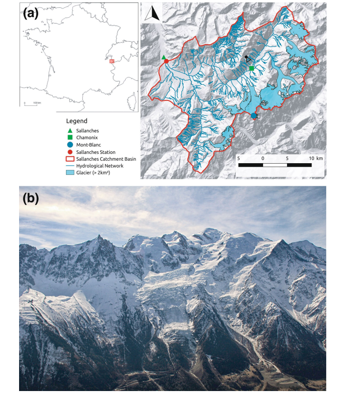
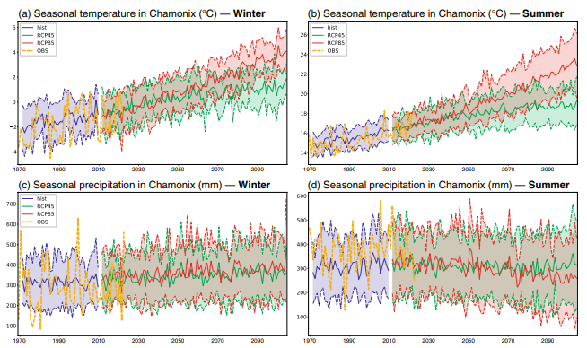

# Le changement climatique peut il être observé dans les Alpes?

## Consignes

Ce TP peut être réalisé sur [MyDocker]. XX TODO ADD
Vous devrez rendre ce notebook avec les fonctions/ votre script python ainsi qu'un compte-rendu de 8 pages maximum dans lequel vous répondrez aux questions.
**Le compte-rendu au format PDF et le notebook** sont à rendre par email avant le prochain cours soit **lundi 17 janvier 23h59**. J'ouvrirai mes mails au réveil, et à partir de là, -2 points par heure de retard.

## Introduction

En science des données vous devrez préparer les données, les analyser (statistiquement) et produire des figures pertinentes dans l'objectif de répondre à différentes questions.

Dans ce TP, on se demande si le changement climatique est visible dans les Alpes et nous mettrons en lien les observations avec les analyses des flux hydrométriques (= le force du courant dans les rivières) dans cette région. 

Pour ce faire nous allons commencer par étudier l'évolution de la météo au cours des dernières décennies. Météo France, l'organisme national de météorologie en France, a déposé des données climatologiques par département avec de nombreux paramètres disponibles sur le site [data.gouv](https://www.data.gouv.fr/fr/datasets/donnees-climatologiques-de-base-quotidiennes/).

Dans un second temps, nous étudierons l'évolution des débits de l'Arve (une rivière) en lien avec le changement climatique et la fonte des glaciers aux alentours du Mont-Blanc (un massif *relativement* connu des Alpes). Le papier a été publié dans Scientific Reports en 2020 et est disponible [ici](https://doi.org/10.1038/s41598-020-67379-7).

## Chargement des librairies


Voici quelques librairies dont vous aurez très probablement besoin, n'hésitez pas a en ajouter d'autres !

```python
import pandas as pd
import numpy as np
import matplotlib.pyplot as plt
import seaborn as sns
%matplotlib inline

from sklearn.model_selection import train_test_split
from sklearn.linear_model import LinearRegression

```

## Optimisation du code

Pensez à optimiser votre code pour améliorer l'efficacité, en particulier lorsqu'il s'agit de manipuler de grandes quantités de données. Utilisez des fonctions pour que vous puissiez refaire la même analyse avec un autre département.


# PARTIE 1: Données climatiques de Météo France

## Chargement du jeu de données 

Commencez par récupérer sur le site des données publiques francaises, les données quotidiennes de météo entre 1950 et 2022 en Haute-Savoie où se situe le Mont-Blanc (département n°74) sur le site [data.gouv](https://www.data.gouv.fr/fr/datasets/donnees-climatologiques-de-base-quotidiennes/).

On ne s'intéresse pour le moment qu'aux données de température et de précipitation.

Quand vous êtes prête ou prêt, chargez la table d'intéret dans la variable `meteo`.

*Indication :* Pour trouver quel fichier télécharger, lisez la documentation!

```python
#Votre code ici
meteo = pd.read_csv ("Q_74_previous-1950-2023_RR-T-Vent.csv", sep = ';')
meteo

```

## Exploration des données

Décrivez la table. Par exempl,e répondez aux questions suivantes:

- Quelle sont les dimensions de `meteo` ? 1294509 * 58
- Combien y a-t-il de postes météorologiques ? 
    
Vos réponses sont à rédiger dans le compte-rendu pas dans le notebook, ici je n'évaluerai que les fonctions!

```python
#Votre code ici
postes = meteo['NUM_POSTE'].nunique()
postes
```

**Gestion des valeurs manquantes et filtration**

- Quelles colonnes allez vous sélectionner pour notre étude ? Pour rappel, on va étudier l'évolution de la température et des précipitations depuis les années 1950 dans les Alpes.
*Indication:* La localisation des postes pourra être utile.
- Créer la table `meteo_cleaned` avec les colonnes d'interet et sans données manquantes.
- Faites une première analyse sur les informations statistiques de base sur les données (moyenne, médiane, écart-type, etc.).


```python
#Votre code ici


meteo_cleaned = meteo[['NUM_POSTE', 'NOM_USUEL', 'LAT', 'LON', 'ALTI', 'AAAAMMJJ', 'RR', 'QRR', 'TN', 'QTN', 'HTN', 'QHTN', 'TX', 'QTX', 'HTX', 'QHTX', 'TM', 'QTM', 'TNTXM', 'QTNTXM', 
                       'TAMPLI', 'QTAMPLI', 'TNSOL', 'QTNSOL', 'TN50', 'QTN50', 'DG', 'QDG', 'DRR', 'QDRR']]

meteo_cleaned = meteo_cleaned.dropna(subset=['RR', 'TNTXM'] )

```

```python
#Votre code ici
#contrôle de qualité
qualite= ['RR', 'QRR', 'TN', 'QTN', 'HTN', 'QHTN', 'TX', 'QTX', 'HTX', 'QHTX', 'TM', 'QTM', 'TNTXM', 'QTNTXM', 
        'TAMPLI', 'QTAMPLI', 'TNSOL', 'QTNSOL', 'TN50', 'QTN50', 'DG', 'QDG', 'DRR', 'QDRR']
val_valides = [0,1,9]
for i in range (1,len(qualite),2):
    meteo_cleaned.loc[~meteo_cleaned[qualite[i]].isin(val_valides), qualite[i-1]]= pd.NA

#après avoir fait le controle de qualité, on elimine les colonnes de qualité

meteo_cleaned.drop(columns = ['QRR', 'QTN','QHTN', 'QTX','QHTX', 'QTM', 'QTNTXM', 'QTAMPLI','QTNSOL', 'QTN50','QDG','QDRR'], inplace = True)


```

```python
#On remplace les valeurs de NaN  par la moyenne de la colonne.

cols = ['RR', 'TN','HTN', 'TX','HTX', 'TM', 'TNTXM', 'TAMPLI','TNSOL', 'TN50','DG','DRR']
for i in cols:
    meteo_cleaned[i].fillna(meteo_cleaned[i].mean(skipna=True), inplace = True)
meteo_cleaned
```

```python
meteo_cleaned.describe()
```

- Combien de stations restent dans notre étude ? Où se situent-elles ?

```python
#Votre code ici
stations = meteo_cleaned['NUM_POSTE'].nunique()
ubication = meteo_cleaned['NOM_USUEL'].unique()
print(ubication)
print(stations)
```

## Analyse des données


### Tendances annuelles

Quelles sont les tendances annuelles dans les données météorologiques depuis 1950 ? La température moyenne a-t-elle changée ? Est-ce qu'il y a plus ou moins de précipitations ?

Faites une analyse (calcul de moyenne, tests de regressions etc) pour répondre à la question. Ci-dessous voici les principales étapes à effectuer:
- Transformez la colonne date pour que vous puissiez l'exploiter facilement
- Calculez les températures et précipitations moyennes annuelles
- Faites une régression linéaire pour estimer l'évolution de ces valeurs. Utilisez scikit-learn comme appris en L1 ISD.
- Evaluez la performance de vos modèles de prédiction. Pour cela, vous pourrez par exemple utiliser les métriques disponibles dans `sklearn.metrics`.
- La régression est-elle pertinente pour la température ? Pour les précipitations ?
- Auriez-vous un autre modèle plus pertinent qu'une régression linéaire à proposer ? N'hésitez pas à l'**ajouter**.
- Crééz également un ou plusieurs graphiques pour représenter les variations des paramètres météorologiques au fil du temps.

Si besoin vous pouvez charger de nouvelles librairies.

```python
#Votre code ici
# modifications de la date
meteo_cleaned['AAAAMMJJ'] = pd.to_datetime(meteo_cleaned['AAAAMMJJ'], format='%Y%m%d')
meteo_cleaned

```

```python
meteo_cleaned['Year'] = meteo_cleaned['AAAAMMJJ'].dt.year
annual_data = meteo_cleaned.groupby('Year').agg({
    'TNTXM': 'mean',
    'RR': 'mean',

}).reset_index()
annual_data.rename(columns={'TNTXM': 'Mean_Temperature', 'RR': 'Mean_Precipitation'}, inplace=True)
annual_data

```

```python
plt.figure(figsize=(14, 6))

plt.subplot(1, 2, 1)
sns.lineplot(data=annual_data, x='Year', y='Mean_Temperature', marker='o', color='red')
plt.title("Évolution de la température moyenne annuelle")
plt.xlabel("Année")
plt.ylabel("Température moyenne (°C)")

plt.subplot(1, 2, 2)
sns.lineplot(data=annual_data, x='Year', y='Mean_Precipitation', marker='o', color='blue')
plt.title("Évolution de la précipitation moyenne annuelle")
plt.xlabel("Année")
plt.ylabel("Précipitation moyenne par jour (mm)")

plt.tight_layout()
plt.show()

```

```python
from sklearn.linear_model import LinearRegression
from sklearn.metrics import mean_squared_error, r2_score
from sklearn.model_selection import train_test_split

# Régression linéaire sur la température
X_temp = annual_data[['Year']]
y_temp = annual_data['Mean_Temperature']

X_temp_train, X_temp_test, y_temp_train, y_temp_test = train_test_split(
    X_temp, y_temp, test_size=0.2, random_state=42
)

model_temp = LinearRegression()
model_temp.fit(X_temp_train, y_temp_train)

y_temp_pred = model_temp.predict(X_temp_test)
mse_temp = mean_squared_error(y_temp_test, y_temp_pred)
rmse_temp = np.sqrt(mse_temp)
r2_temp = r2_score(y_temp_test, y_temp_pred)

print("Modèle Température :")
print(f" - Coefficient (pente) : {model_temp.coef_[0]:.3f} °C/an")
print(f" - RMSE : {rmse_temp:.3f}")
print(f" - R²   : {r2_temp:.3f}\n")

# Régression linéaire sur la précipitation
X_precip = annual_data[['Year']]
y_precip = annual_data['Mean_Precipitation']

X_precip_train, X_precip_test, y_precip_train, y_precip_test = train_test_split(
    X_precip, y_precip, test_size=0.2, random_state=42
)

model_precip = LinearRegression()
model_precip.fit(X_precip_train, y_precip_train)

y_precip_pred = model_precip.predict(X_precip_test)
mse_precip = mean_squared_error(y_precip_test, y_precip_pred)
rmse_precip = np.sqrt(mse_precip)
r2_precip = r2_score(y_precip_test, y_precip_pred)


print("Modèle Précipitation :")
print(f" - Coefficient (pente) : {model_precip.coef_[0]:.3f} mm/an")
print(f" - RMSE : {rmse_precip:.3f}")
print(f" - R²   : {r2_precip:.3f}\n")

# Visualiser la droite de régression - Température
plt.figure(figsize=(12, 5))

plt.subplot(1, 2, 1)
sns.scatterplot(x='Year', y='Mean_Temperature', data=annual_data, color='red', label="Données")
X_plot = annual_data[['Year']]
y_plot_temp = model_temp.predict(X_plot)
plt.plot(annual_data['Year'], y_plot_temp, color='black', label="Régression linéaire")
plt.xlabel("Année")
plt.ylabel("Température (°C)")
plt.title("Tendance de la température moyenne annuelle")
plt.legend()

# Visualiser la droite de régression - Précipitation
plt.subplot(1, 2, 2)
sns.scatterplot(x='Year', y='Mean_Precipitation', data=annual_data, color='blue', label="Données")
y_plot_precip = model_precip.predict(X_plot)
plt.plot(annual_data['Year'], y_plot_precip, color='black', label="Régression linéaire")
plt.xlabel("Année")
plt.ylabel("Précipitation (mm)")
plt.title("Tendance de la précipitation moyenne annuelle")
plt.legend()

plt.tight_layout()
plt.show()
```

### Prévisions

Quelle température fera-t-il en 2100 selon votre modèle ?


```python
#Votre code ici
annee_future = pd.DataFrame({'Year': [2100]})
temperature_predite_2100 = model_temp.predict(annee_future)

# Afficher le résultat
print(f"La température prédite pour l'année 2100 est de {temperature_predite_2100[0]:.2f} °C.")

```

### Variabilité saisonnière 

Analysez la variabilité saisonnière des données. 

- Manipulez les données pour les regrouper mois par mois. Y a-t-il des tendances ? Correspondent-elles à vos connaissances ?
- N'oubliez pas de visualisez les données
- Enfin si vous êtes à l'aise, étudiez en plus les épisodes de fortes chaleurs (températures > 28°C). Est-ce qu'il y en a plus souvent plus récemment?


```python
#Votre code ici
meteo_cleaned['Month'] = meteo_cleaned['AAAAMMJJ'].dt.month
seasonal_data = meteo_cleaned.groupby('Month').agg({
    'TNTXM': 'mean',
    'RR': 'mean'
}).reset_index()

seasonal_data.rename(columns={'TNTXM': 'Temperature_Moyenne', 'RR': 'Precipitation_Moyenne'}, inplace=True)
# Visualisation
plt.figure(figsize=(14, 5))

# Subplot 1 : Température moyenne par mois
plt.subplot(1, 2, 1)
sns.barplot(x='Month', y='Temperature_Moyenne', data=seasonal_data, palette='coolwarm')
plt.title("Température Moyenne par Mois (toutes années confondues)")
plt.xlabel("Mois")
plt.ylabel("Température (°C)")

# Subplot 2 : Précipitation moyenne par mois
plt.subplot(1, 2, 2)
sns.barplot(x='Month', y='Precipitation_Moyenne', data=seasonal_data, palette='Blues')
plt.title("Précipitation Moyenne par Mois (toutes années confondues)")
plt.xlabel("Mois")
plt.ylabel("Précipitation (mm)")

plt.tight_layout()
plt.show()
```

```python
# 1) Créer l'indicateur booléen par relevé
meteo_cleaned['forte_chaleur'] = meteo_cleaned['TX'] > 28

# 2) Extraire la date (jour) à partir de AAAAMMJJ
meteo_cleaned['DateOnly'] = meteo_cleaned['AAAAMMJJ'].dt.date

# 3) Déterminer si une journée a connu une forte chaleur (max booléen)
chaleur_jour = meteo_cleaned.groupby(['Year', 'DateOnly'])['forte_chaleur'].max().reset_index()

# 4) Compter combien de jours de forte chaleur par année
chaleur_annuelle = chaleur_jour.groupby('Year')['forte_chaleur'].sum().reset_index()
chaleur_annuelle.rename(columns={'forte_chaleur': 'Jours_ForteChaleur'}, inplace=True)


# 5) Visualiser
plt.figure(figsize=(10, 6))  # Ajustez la taille selon le nombre d'années

# Créer le graphique à barres
sns.barplot(x='Year', y='Jours_ForteChaleur', data=chaleur_annuelle, palette='Reds')

# Ajouter le titre et les labels des axes
plt.title("Nombre de Jours de Forte Chaleur (TX > 28°C) par Année")
plt.xlabel("Année")
plt.ylabel("Nombre de jours")

# Obtenir la liste des années triées
years = sorted(chaleur_annuelle['Year'].unique())

# Créer une liste d'étiquettes où seules les années divisibles par 10 sont affichées
tick_labels = [year if year % 5 == 0 else '' for year in years]

# Appliquer les étiquettes à l'axe des abscisses
plt.xticks(ticks=range(len(years)), labels=tick_labels, rotation=45)

# Améliorer l'espacement pour éviter que les étiquettes ne soient coupées
plt.tight_layout()

# Afficher le graphique
plt.show()
```

<!-- #region -->
# PARTIE 2: Evolution des débits de l'Arve


Dans cet [article](https://doi.org/10.1038/s41598-020-67379-7), les autrices et les auteurs examinent l'impact du changement climatique et de la perte de masse des glaciers sur l'hydrologie du massif du Mont-Blanc, en particulier sur le bassin versant de la rivière Arve, qui est alimentée par une série de glaciers dans la région. Ils ont utilisé des projections climatiques (scénarios RCP4.5 et RCP8.5) et des simulations de dynamique des glaciers (historiques et futures) combinées a un modèle hydrologique pour étudier l'évolution du débit des rivières à l'échelle du 21e siècle (vus en cours).

Vous avez représenté ci-dessous la zone d'étude de l'article avec en panneau (a), la localisation du bassin versant de Sallanches dans les Alpes françaises et la carte des bassins étudiés et en panneau (b), le massif du Mont-Blanc vu de Téléphérique de la Flégère (point noir avec angle de vue sur le plan).


<!-- #endregion -->

<!-- #region -->
Dans leur article, ils commencent par étudier l'évolution des températures et des précipitations à Sallances. Ils montrent qu'il y a une nette augmentation des températures estivales et hivernales dans la région du Mont-Blanc et des modificaions de précipitations. Cela correspond à la figure 2 représentée ci-dessous. **Avez-vous obtenus les mêmes résultats avec votre analyse de la partie 1?** 





<!-- #endregion -->

Dans cette partie, nous allons reproduire la figure n°3 du papier qui illustre l'évolution des débits saisonniers de la rivière Arve en fonction des scénarios climatiques. La figure présente des courbes pour les débits moyens (en hiver et en été) simulées sous les scénarios RCP4.5 et RCP8.5, à partir de différents modèles climatiques pour la région du Mont-Blanc.


## Chargement des données

Dans le dossier `Donnees_Debits/`, vous disposez de données simulées historiques ainsi que de projections futures des débits cumulés (et de leur écart-type) de la rivière Arve (pour chaque scénario climatique). Ces données sont organisées en fonction des saisons (hiver, été ou moyenne annuelle) et des différents scénarios climatiques (historiques, RCP4.5, RCP8.5). 
Vous disposez également des séries temporelles de débits observés (`Debits_obs_Sal_sans_2902`) pour la saison d'hiver et d'été, qui servent de référence pour la comparaison des simulations.


**Regardez un peu les données. Quelles sont les dimensions des données historiques et des données de modélisation ?**

*Indications: Pour rappel, les deux scénarios RCP font partie des trajectoires d'émissions de gaz à effet de serre utilisées pour projeter les futurs changements climatiques. Pour chacun d'eux, plusieurs modèles climatiques régionaux ont été utilisés pour simuler l'évolution du climat et ensuite du débit de la rivière. Les différents modèles régionaux sont des modèles climatiques spécifiques, souvent *downscalés* (affinés à une échelle régionale) pour mieux simuler les conditions climatiques locales du Mont Blanc. Le processus de downscaling permet d'obtenir des projections climatiques à une résolution spatiale plus fine que celle des modèles climatiques globaux.* 


```python
#Votre code ici
import os
donnees = [[
    "Q_cum_hist_annee_multimodeles_OK",
    "Q_cum_hist_ete_multimodeles_OK",
    "Q_cum_hist_hiver_multimodeles_OK",
    "Q_sd_hist_annee_multimodeles_OK",
    "Q_sd_hist_ete_multimodeles_OK",
    "Q_sd_hist_hiver_multimodeles_OK"
], [
    "Q_cum_hist_annee_obs",
    "Q_cum_hist_ete_obs",
    "Q_cum_hist_hiver_obs",
    "Q_sd_hist_annee_obs",
    "Q_sd_hist_ete_obs",
    "Q_sd_hist_hiver_obs"
], [
    "Q_cum_RCP4-5_annee_multimodeles_OK",
    "Q_cum_RCP4-5_ete_multimodeles_OK",
    "Q_cum_RCP4-5_hiver_multimodeles_OK",
    "Q_sd_RCP4-5_annee_multimodeles_OK",
    "Q_sd_RCP4-5_ete_multimodeles_OK",
    "Q_sd_RCP4-5_hiver_multimodeles_OK"
], [
    "Q_cum_RCP8-5_annee_multimodeles_OK",
    "Q_cum_RCP8-5_ete_multimodeles_OK",
    "Q_cum_RCP8-5_hiver_multimodeles_OK",
    "Q_sd_RCP8-5_annee_multimodeles_OK",
    "Q_sd_RCP8-5_ete_multimodeles_OK",
    "Q_sd_RCP8-5_hiver_multimodeles_OK"]]

liste = ["Dimensions des données historique","Dimensions des données obs","Dimensions des données RCP4-5","Dimensions des données RCP8-5"]
i=0
for donnee in donnees:
    print("\n", liste[i], "\n")
    i = i + 1
    for d in donnee:
        df = pd.read_csv(os.path.join("Donnees_Debits", d))
        print(f"Dimension du fichier {d}: {df.shape}")

```

## Analyse et création de fonctions

**Etant donné une saison, faites une fonction qui pour chaque scenario (historique, ou RCP), calcule la moyenne et l'écart-type moyen du débit pour chaque année. Commencez par charger les données et transformer la date pour pouvoir extraire l'année. Dans un second temps, chargez les données observées et extrayez la valeur pour la saison considérée. Puis, reproduisez les graphiques montrant l'évolution du débit moyen pour les saisons d'hiver et d'été, sous les deux scénarios RCP4.5 et RCP8.5, comparés aux données historiques et aux données observées.**

Est-ce clair pour vous, quelle est la différence entre les données observées et historiques ?


**Discutez comment le changement climatique impacte les ressources en eau dans les régions montagneuses.**


```python
#Votre code ici

#données hist ete 
data_cum_hist_ete_multimodeles_OK =  pd.read_csv("Donnees_Debits/Q_cum_hist_ete_multimodeles_OK", sep = ',')
data_sd_hist_ete_multimodeles_OK =  pd.read_csv("Donnees_Debits/Q_sd_hist_ete_multimodeles_OK", sep = ',')

#données hist hiver
data_cum_hist_hiver_multimodeles_OK =  pd.read_csv("Donnees_Debits/Q_cum_hist_hiver_multimodeles_OK", sep = ',')
data_sd_hist_hiver_multimodeles_OK =  pd.read_csv("Donnees_Debits/Q_sd_hist_hiver_multimodeles_OK", sep = ',')

#données hist annee
data_cum_hist_annee_multimodeles_OK =  pd.read_csv("Donnees_Debits/Q_cum_hist_annee_multimodeles_OK", sep = ',')
data_sd_hist_annee_multimodeles_OK =  pd.read_csv("Donnees_Debits/Q_sd_hist_annee_multimodeles_OK", sep = ',')

#données obs ete
data_cum_hist_ete_obs =  pd.read_csv("Donnees_Debits/Q_cum_hist_ete_obs", sep = ',')
data_sd_hist_ete_obs =  pd.read_csv("Donnees_Debits/Q_sd_hist_ete_obs", sep = ',')

#données obs hiver
data_cum_hist_hiver_obs =  pd.read_csv("Donnees_Debits/Q_cum_hist_hiver_obs", sep = ',')
data_sd_hist_hiver_obs =  pd.read_csv("Donnees_Debits/Q_sd_hist_hiver_obs", sep = ',')

#données obs annee
data_cum_hist_annee_obs =  pd.read_csv("Donnees_Debits/Q_cum_hist_annee_obs", sep = ',')
data_sd_hist_annee_obs =  pd.read_csv("Donnees_Debits/Q_sd_hist_annee_obs", sep = ',')

#données RCP4-5 ete
data_cum_RCP4_5_ete_multimodeles_OK =  pd.read_csv("Donnees_Debits/Q_cum_RCP4-5_ete_multimodeles_OK", sep = ',')
data_sd_RCP4_5_ete_multimodeles_OK =  pd.read_csv("Donnees_Debits/Q_sd_RCP4-5_ete_multimodeles_OK", sep = ',')

#données RCP4-5 hiver
data_cum_RCP4_5_hiver_multimodeles_OK =  pd.read_csv("Donnees_Debits/Q_cum_RCP4-5_hiver_multimodeles_OK", sep = ',')
data_sd_RCP4_5_hiver_multimodeles_OK =  pd.read_csv("Donnees_Debits/Q_sd_RCP4-5_hiver_multimodeles_OK", sep = ',')

#données RCP4-5 annee
data_cum_RCP4_5_annee_multimodeles_OK =  pd.read_csv("Donnees_Debits/Q_cum_RCP4-5_annee_multimodeles_OK", sep = ',')
data_sd_RCP4_5_annee_multimodeles_OK =  pd.read_csv("Donnees_Debits/Q_sd_RCP4-5_annee_multimodeles_OK", sep = ',')

#données RCP8-5 ete
data_cum_RCP8_5_ete_multimodeles_OK =  pd.read_csv("Donnees_Debits/Q_cum_RCP8-5_ete_multimodeles_OK", sep = ',')
data_sd_RCP8_5_ete_multimodeles_OK =  pd.read_csv("Donnees_Debits/Q_sd_RCP8-5_ete_multimodeles_OK", sep = ',')

#données RCP8-5 hiver
data_cum_RCP8_5_hiver_multimodeles_OK =  pd.read_csv("Donnees_Debits/Q_cum_RCP8-5_hiver_multimodeles_OK", sep = ',')
data_sd_RCP8_5_hiver_multimodeles_OK =  pd.read_csv("Donnees_Debits/Q_sd_RCP8-5_hiver_multimodeles_OK", sep = ',')

#données RCP8-5 annee
data_cum_RCP8_5_annee_multimodeles_OK =  pd.read_csv("Donnees_Debits/Q_cum_RCP8-5_annee_multimodeles_OK", sep = ',')
data_sd_RCP8_5_annee_multimodeles_OK =  pd.read_csv("Donnees_Debits/Q_sd_RCP8-5_annee_multimodeles_OK", sep = ',')


def plot_scenarios(data_hist, data_hist_sd,
                   data_rcp4, data_rcp4_sd,
                   data_rcp8, data_rcp8_sd,
                   title="Évolution Année",
                   ylabel="Débit cumulé",
                   xlabel="Année"):
    plt.figure(figsize=(10, 6))

    # Historique
    plt.plot(data_hist['Year'], data_hist['mean'], label='Historique', color='blue')
    plt.fill_between(
        data_hist['Year'],
        data_hist['mean'] - data_hist_sd['std'],
        data_hist['mean'] + data_hist_sd['std'],
        alpha=0.2, color='blue'
    )

    # RCP4.5
    plt.plot(data_rcp4['Year'], data_rcp4['mean'], label='RCP4.5', color='green')
    plt.fill_between(
        data_rcp4['Year'],
        data_rcp4['mean'] - data_rcp4_sd['std'],
        data_rcp4['mean'] + data_rcp4_sd['std'],
        alpha=0.2, color='green'
    )

    # RCP8.5
    plt.plot(data_rcp8['Year'], data_rcp8['mean'], label='RCP8.5', color='red')
    plt.fill_between(
        data_rcp8['Year'],
        data_rcp8['mean'] - data_rcp8_sd['std'],
        data_rcp8['mean'] + data_rcp8_sd['std'],
        alpha=0.2, color='red'
    )

    plt.title(title)
    plt.xlabel(xlabel)
    plt.ylabel(ylabel)
    plt.legend()
    plt.tight_layout()
    plt.grid(True)
    plt.show()


modele_cols = data_cum_hist_ete_multimodeles_OK.columns[1:]  

data_cum_hist_ete_multimodeles_OK['mean'] = data_cum_hist_ete_multimodeles_OK[modele_cols].mean(axis=1)
data_cum_hist_ete_multimodeles_OK['Year'] = data_cum_hist_ete_multimodeles_OK['Date']

data_sd_hist_ete_multimodeles_OK['std'] = data_sd_hist_ete_multimodeles_OK[modele_cols].mean(axis=1)  # ou autre calcul
data_sd_hist_ete_multimodeles_OK['Year'] = data_sd_hist_ete_multimodeles_OK['Date']

data_cum_RCP4_5_ete_multimodeles_OK['mean'] = data_cum_RCP4_5_ete_multimodeles_OK[modele_cols].mean(axis=1)
data_cum_RCP4_5_ete_multimodeles_OK['Year'] = data_cum_RCP4_5_ete_multimodeles_OK['Date']

data_sd_RCP4_5_ete_multimodeles_OK['std'] = data_sd_RCP4_5_ete_multimodeles_OK[modele_cols].mean(axis=1)
data_sd_RCP4_5_ete_multimodeles_OK['Year'] = data_sd_RCP4_5_ete_multimodeles_OK['Date']

data_cum_RCP8_5_ete_multimodeles_OK['mean'] = data_cum_RCP8_5_ete_multimodeles_OK[modele_cols].mean(axis=1)
data_cum_RCP8_5_ete_multimodeles_OK['Year'] = data_cum_RCP8_5_ete_multimodeles_OK['Date']

data_sd_RCP8_5_ete_multimodeles_OK['std'] = data_sd_RCP8_5_ete_multimodeles_OK[modele_cols].mean(axis=1)
data_sd_RCP8_5_ete_multimodeles_OK['Year'] = data_sd_RCP8_5_ete_multimodeles_OK['Date']

plot_scenarios(
    data_cum_hist_ete_multimodeles_OK, data_sd_hist_ete_multimodeles_OK,
    data_cum_RCP4_5_ete_multimodeles_OK, data_sd_RCP4_5_ete_multimodeles_OK,
    data_cum_RCP8_5_ete_multimodeles_OK, data_sd_RCP8_5_ete_multimodeles_OK,
    title="Débits Cumulés en Ete",
    ylabel="Débit cumulé (m³/s)",
    xlabel="Année"
)

```

```python
modele_cols = data_cum_hist_hiver_multimodeles_OK.columns[1:]  
data_cum_hist_hiver_multimodeles_OK['mean'] = data_cum_hist_hiver_multimodeles_OK[modele_cols].mean(axis=1)
data_cum_hist_hiver_multimodeles_OK['Year'] = data_cum_hist_hiver_multimodeles_OK['Date']

data_sd_hist_hiver_multimodeles_OK['std'] = data_sd_hist_hiver_multimodeles_OK[modele_cols].mean(axis=1)  # ou autre calcul
data_sd_hist_hiver_multimodeles_OK['Year'] = data_sd_hist_hiver_multimodeles_OK['Date']

data_cum_RCP4_5_hiver_multimodeles_OK['mean'] = data_cum_RCP4_5_hiver_multimodeles_OK[modele_cols].mean(axis=1)
data_cum_RCP4_5_hiver_multimodeles_OK['Year'] = data_cum_RCP4_5_hiver_multimodeles_OK['Date']

data_sd_RCP4_5_hiver_multimodeles_OK['std'] = data_sd_RCP4_5_hiver_multimodeles_OK[modele_cols].mean(axis=1)
data_sd_RCP4_5_hiver_multimodeles_OK['Year'] = data_sd_RCP4_5_hiver_multimodeles_OK['Date']

data_cum_RCP8_5_hiver_multimodeles_OK['mean'] = data_cum_RCP8_5_hiver_multimodeles_OK[modele_cols].mean(axis=1)
data_cum_RCP8_5_hiver_multimodeles_OK['Year'] = data_cum_RCP8_5_hiver_multimodeles_OK['Date']

data_sd_RCP8_5_hiver_multimodeles_OK['std'] = data_sd_RCP8_5_hiver_multimodeles_OK[modele_cols].mean(axis=1)
data_sd_RCP8_5_hiver_multimodeles_OK['Year'] = data_sd_RCP8_5_hiver_multimodeles_OK['Date']

plot_scenarios(
    data_cum_hist_hiver_multimodeles_OK, data_sd_hist_hiver_multimodeles_OK,
    data_cum_RCP4_5_hiver_multimodeles_OK, data_sd_RCP4_5_hiver_multimodeles_OK,
    data_cum_RCP8_5_hiver_multimodeles_OK, data_sd_RCP8_5_hiver_multimodeles_OK,
    title="Débits Cumulés en Hiver",
    ylabel="Débit cumulé (m³/s)",
    xlabel="Année"
)
```

```python
modele_cols = data_cum_hist_annee_multimodeles_OK.columns[1:] 
data_cum_hist_annee_multimodeles_OK['mean'] = data_cum_hist_annee_multimodeles_OK[modele_cols].mean(axis=1)
data_cum_hist_annee_multimodeles_OK['Year'] = data_cum_hist_annee_multimodeles_OK['Date']

data_sd_hist_annee_multimodeles_OK['std'] = data_sd_hist_annee_multimodeles_OK[modele_cols].mean(axis=1)  # ou autre calcul
data_sd_hist_annee_multimodeles_OK['Year'] = data_sd_hist_annee_multimodeles_OK['Date']

data_cum_RCP4_5_annee_multimodeles_OK['mean'] = data_cum_RCP4_5_annee_multimodeles_OK[modele_cols].mean(axis=1)
data_cum_RCP4_5_annee_multimodeles_OK['Year'] = data_cum_RCP4_5_annee_multimodeles_OK['Date']

data_sd_RCP4_5_annee_multimodeles_OK['std'] = data_sd_RCP4_5_annee_multimodeles_OK[modele_cols].mean(axis=1)
data_sd_RCP4_5_annee_multimodeles_OK['Year'] = data_sd_RCP4_5_annee_multimodeles_OK['Date']

data_cum_RCP8_5_annee_multimodeles_OK['mean'] = data_cum_RCP8_5_annee_multimodeles_OK[modele_cols].mean(axis=1)
data_cum_RCP8_5_annee_multimodeles_OK['Year'] = data_cum_RCP8_5_annee_multimodeles_OK['Date']

data_sd_RCP8_5_annee_multimodeles_OK['std'] = data_sd_RCP8_5_annee_multimodeles_OK[modele_cols].mean(axis=1)
data_sd_RCP8_5_annee_multimodeles_OK['Year'] = data_sd_RCP8_5_annee_multimodeles_OK['Date']

plot_scenarios(
    data_cum_hist_annee_multimodeles_OK, data_sd_hist_annee_multimodeles_OK,
    data_cum_RCP4_5_annee_multimodeles_OK, data_sd_RCP4_5_annee_multimodeles_OK,
    data_cum_RCP8_5_annee_multimodeles_OK, data_sd_RCP8_5_annee_multimodeles_OK,
    title="Débits Cumulés en Annee",
    ylabel="Débit cumulé (m³/s)",
    xlabel="Année"
)

```

```python

```

```python

```
